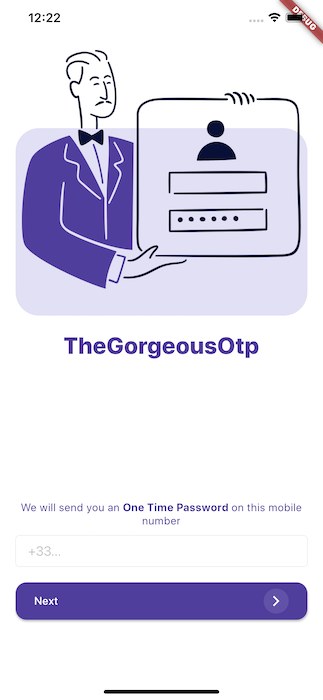
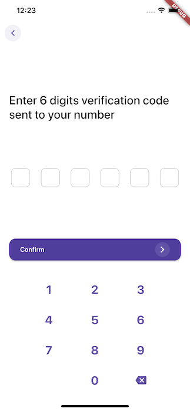

<h1 align="center">The Gorgeous Otp</h1>

<h3 align="center">
  A login page built with flutter inspired by a design found on 
  <a href="https://www.uplabs.com/posts/app-login-with-otp"> Uplabs</a>
</h3>

Login Screen        |  OTP Screen
:-------------------------:|:-------------------------:
  |   

## Tools

This project uses the phone connection provided by [Firebase](https://pub.dev/packages/firebase_auth).
It also uses [MobX](https://pub.dev/packages/mobx) and [Provider](https://pub.dev/packages/provider) to manage the state of the application simply and efficiently. 

## Configuration

This project works with Firebase so you need to import your own Google Services files on Android & iOS folder after creating your Firebase project. Remember to enable phone authentication in your Firebase project.

